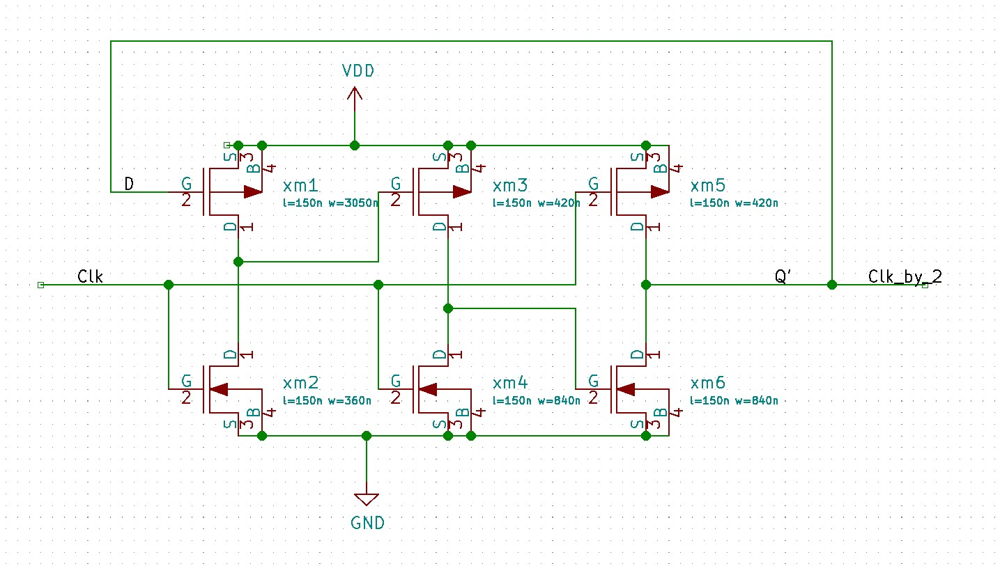
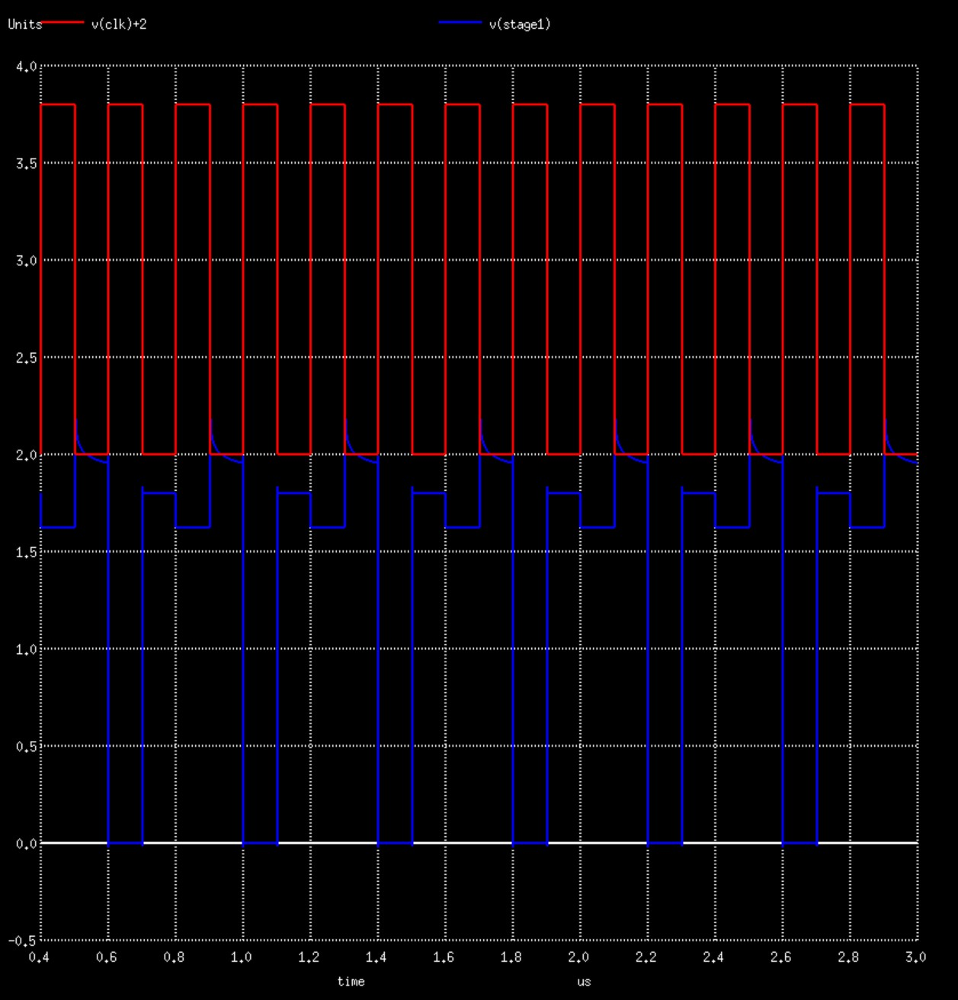
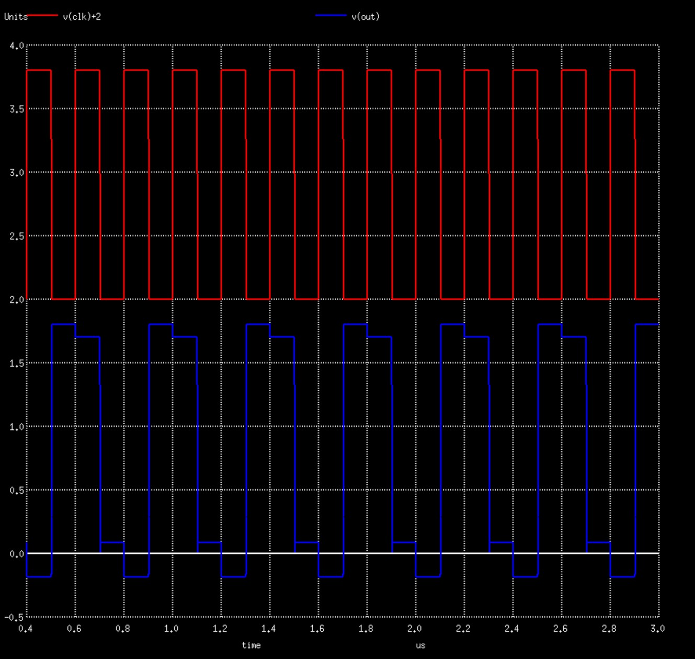

<h2>Method of Optimisation:</h2>

  In a E-TSPC (Extended True Single Phase Clock) Flip-Flop, it's functionality depends very much on the W/L ratios of the transistors.  
  From <b>[1]</b>, It is known that on stage 1 the (W/L)p should be large compared to (W/L)n and in stage 2 and output stage the (W/L)p should be lesser than (W/L)n.  
  This and minimum area, power consumption is kept in mind while optimising by use of smallest possible 'W' for transistors wherever possible.

<b>[1]</b> Q. Du, J. Zhuang and T. Kwasniewski, "A Low Phase Noise Dll Clock Generator with a Programmable Dynamic Frequency Divider," 2006 Canadian Conference on Electrical and Computer Engineering, Ottawa, Ont., 2006, pp. 701-704, doi: 10.1109/CCECE.2006.277703.

<h2>Schematic:</h2>

<h2>Frequency Divider Stage 1:</h2>

<h2>Frequency Divider Stage 2:</h2>

<h2>Frequency Divider Output:</h2>

