# 130nm PLL Clock Multiplier IP
8x PLL Clock Multiplier IP on the Google-Skywater 130nm node.

Tested through spice simulations on skywater 130nm tt corner at room termperature

Generates 8x Multiplied Clock

Duty Cycle obtained ~50%


<h2> Contents: </h2>

1. [Google-SkyWater 130nm PDK](https://github.com/lakshmi-sathi/PLL_Clock_Multiplier_IP/blob/main/README.md-Google-SkyWater-130nm-PDK-)
2. [Pre-Layout Simulations](https://github.com/lakshmi-sathi/PLL_Clock_Multiplier_IP/blob/main/README.md#-Pre-Layout-Simulations-)
3. [Layout](https://github.com/lakshmi-sathi/PLL_Clock_Multiplier_IP/blob/main/README.md#-Layout-)
4. [Post-Layout Simulations](https://github.com/lakshmi-sathi/PLL_Clock_Multiplier_IP/blob/main/README.md#-Post-Layout-Simulations-)
5. [EDA tools used](https://github.com/lakshmi-sathi/PLL_Clock_Multiplier_IP/blob/main/README.md#-EDA-tools-used-)
6. [Instructions:](https://github.com/lakshmi-sathi/PLL_Clock_Multiplier_IP/blob/main/README.md#-Instructions-)
7. [Future Scope](https://github.com/lakshmi-sathi/PLL_Clock_Multiplier_IP/blob/main/README.md#-Future-Scope-)
8. [Acknowledgements](https://github.com/lakshmi-sathi/PLL_Clock_Multiplier_IP/blob/main/README.md#-Acknowledgements-)
9. [Contact](https://github.com/lakshmi-sathi/PLL_Clock_Multiplier_IP/blob/main/README.md#-Contact-)

<h3> Google-SkyWater 130nm PDK: </h3>

>This PLL circuit is built on the [Google-Skywater 130nm](https://github.com/google/skywater-pdk) node. It is a mature 180nm-130nm hybrid technology originally developed internally by Cypress Semiconductor. The SkyWater Open Source PDK is a collaboration between Google and SkyWater Technology Foundry to provide a fully open source Process Design Kit and related resources, which can be used to create manufacturable designs at SkyWater’s facility. 

<h3> Pre-Layout Simulations: </h3>

<h4> PLL Output (tt, 27degree Celcius): </h4>

40Mhz Output: <br>
Trend <br>
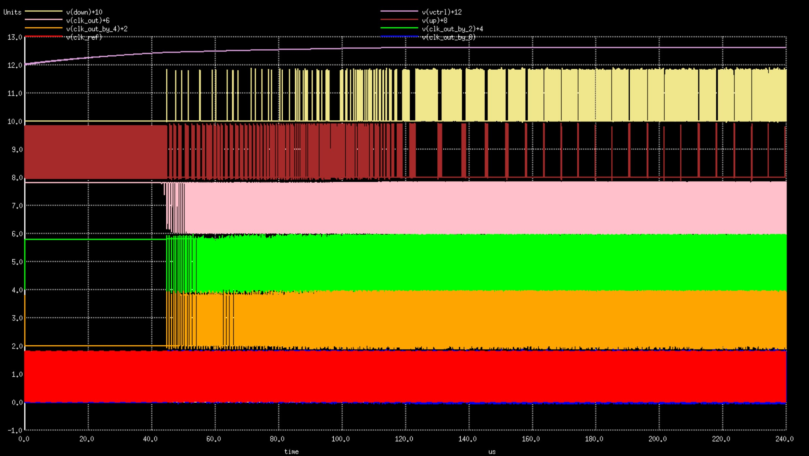
Steady State <br>

100Mhz Output: <br>
Trend <br>
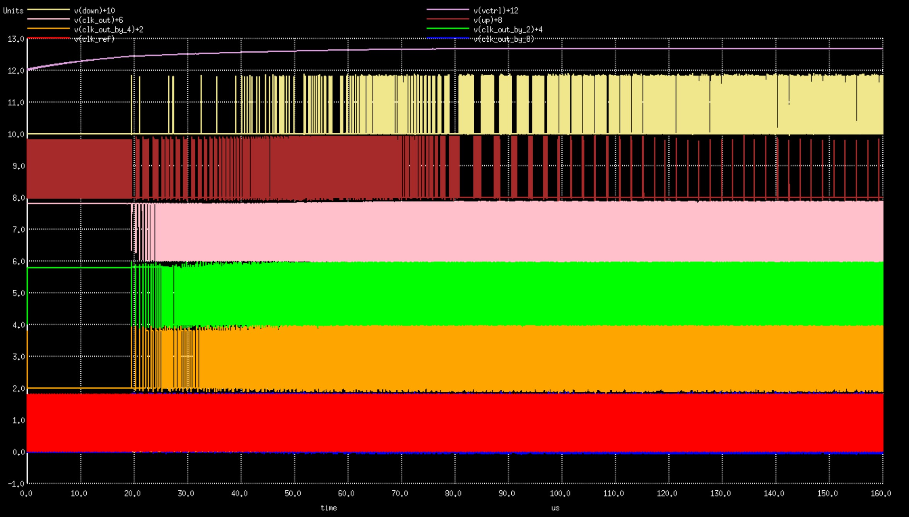
Steady State <br>
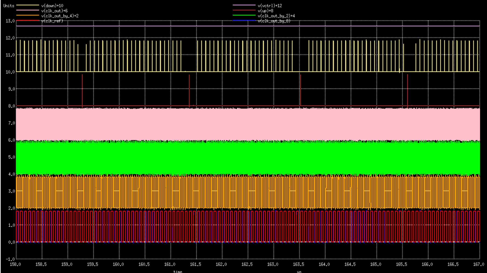


<h4> Phase Frequency Detector 'Up' Signal : </4>

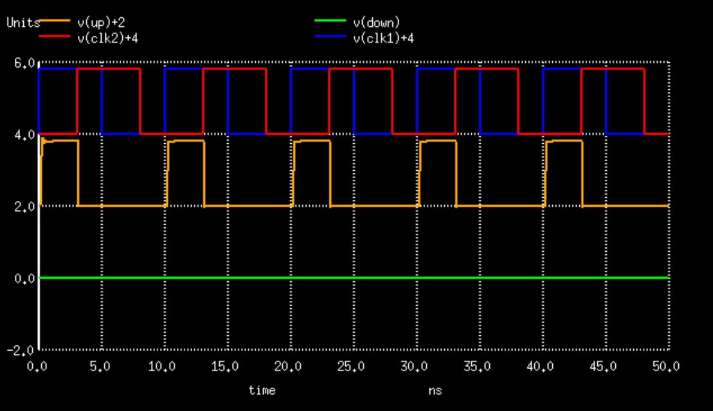

<b>Red:</b> Clock 2 <br>
<b>Blue:</b> Clock 1 <br>
<b>Orange:</b> Up Signal <br>
<b>Green:</b> Down Signal

<h4> Phase Frequency Detector 'Down' Signal : </h4>


<b>Red:</b> Clock 2 <br>
<b>Blue:</b> Clock 1 <br>
<b>Orange:</b> Up Signal <br>
<b>Green:</b> Down Signal

<h4> Charge Pump response to 'Up' signal: </h4>

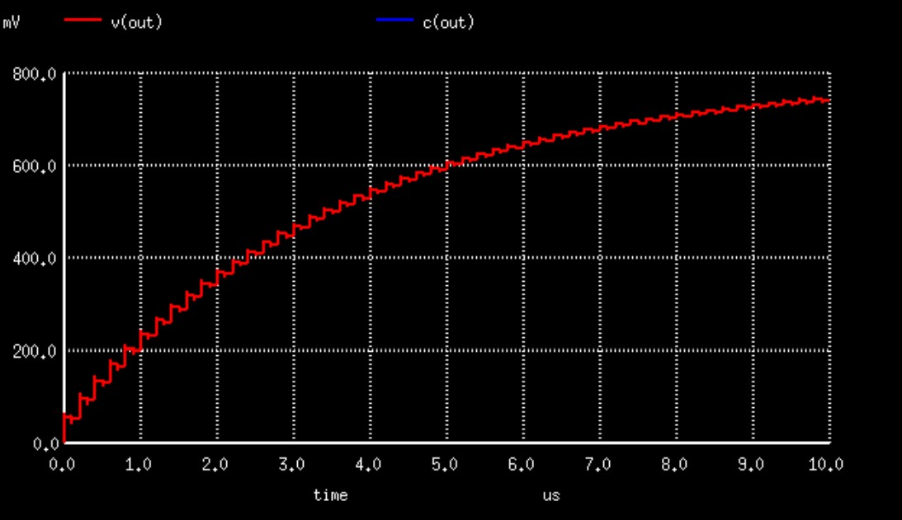

<b>Red:</b> Charge Pump Output Voltage <br>

<h4> Charge Pump response to 'Down' signal: </h4>


<b>Red:</b> Charge Pump Output Voltage<br>

<h4> Charge Pump output rise due to charge leakage: </h4>


<b>Red:</b> Charge Pump Output Voltage <br>
<b>Leakage:</b> 40uV increase every 1us <br>

<h4> Frequency Divider: </h4>


<b>Red:</b> Output Clock <br>
<b>Blue:</b> Input Clock <br>

These above circuits were custom selected to improve stability and reduce area/power consumption:
* [Phase Frequency Detector](https://github.com/lakshmi-sathi/PLL_Clock_Multiplier_IP/tree/main/PhaseFrequencyDetector)

* [Frequency Divider](https://github.com/lakshmi-sathi/PLL_Clock_Multiplier_IP/tree/main/FrequencyDivider) 

* [Charge Pump](https://github.com/lakshmi-sathi/PLL_Clock_Multiplier_IP/tree/main/ChargePump)

* [Voltage Controlled Oscillator](https://github.com/lakshmi-sathi/PLL_Clock_Multiplier_IP/tree/main/Oscillator)

<h3> Layout: </h3>

<h4> Frequency Divider </h4>

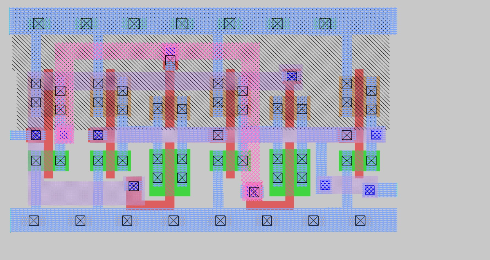

<b> Area: </b> 29.92um square

<h4> Phase Frequency Detector </h4>

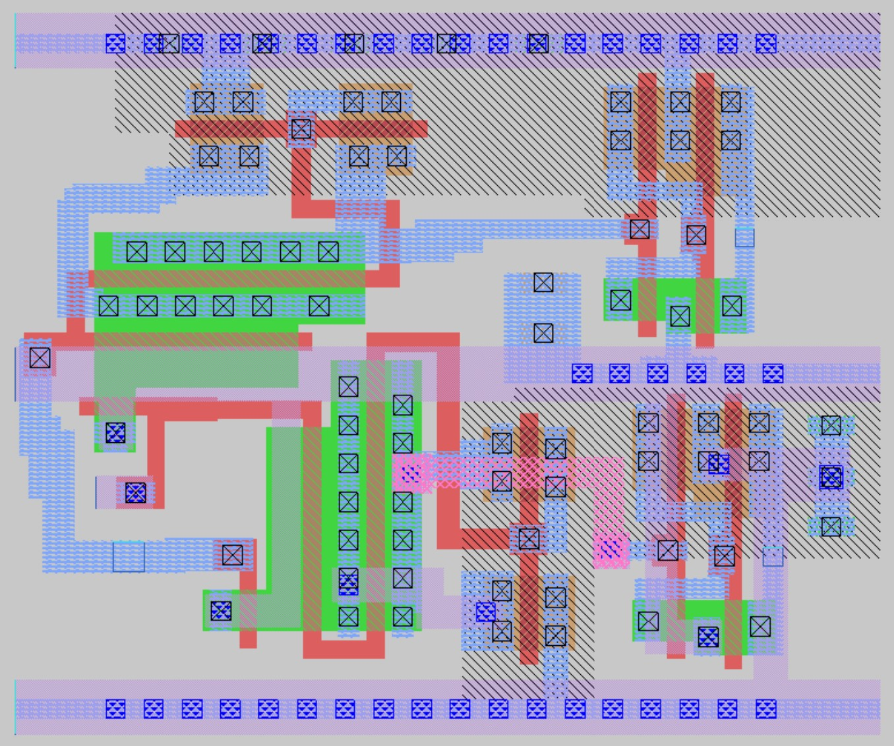

<b> Area: </b> 40.96um square

<h4> Charge Pump </h4>

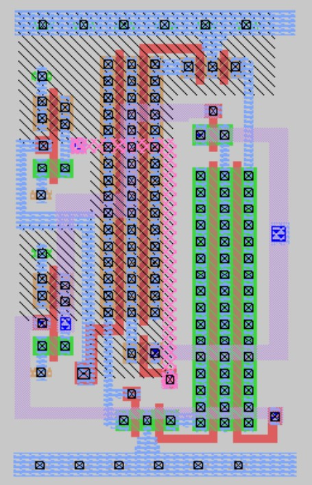

<b> Area: </b> 54.91um square

<h4> Voltage Controlled Oscillator </h4>

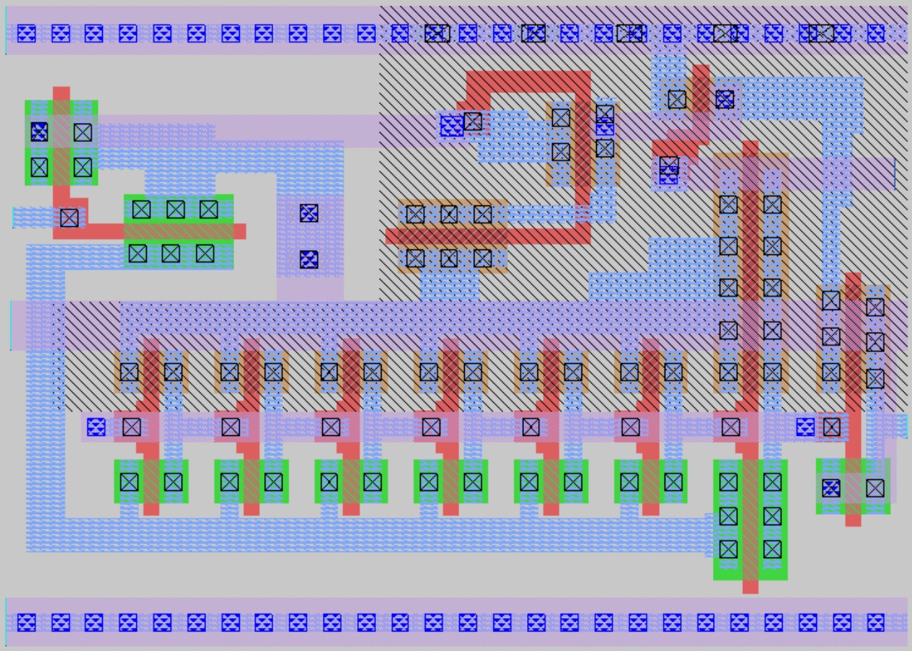

<b> Area: </b> 57.73um square

<h3> Post-Layout Simulations: </h3>

<h4> Phase Frequency Detector 'Up' Signal : </h4>


<b>Red:</b> Clock 1 <br>
<b>Blue:</b> Clock 2 <br>
<b>Orange:</b> Up Signal <br>
<b>Green:</b> Down Signal

<h4> Phase Frequency Detector 'Down' Signal : </h4>


<b>Red:</b> Clock1 2 <br>
<b>Blue:</b> Clock 2 <br>
<b>Orange:</b> Up Signal <br>
<b>Green:</b> Down Signal

<h4> Charge Pump response to 'Up' signal: </h4>

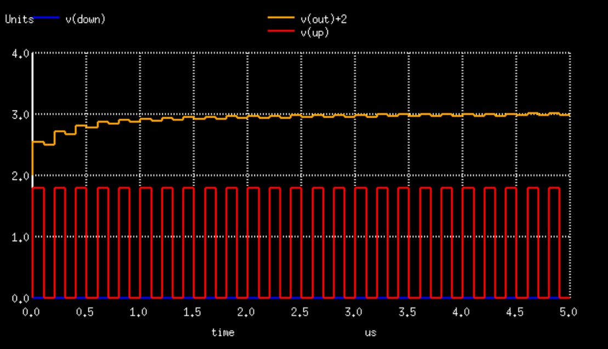

<b>Orange:</b> Charge Pump Output Voltage <br>
<b>Red:</b> Up Signal <br>
<b>Blue:</b> Down Signal

<h4> Charge Pump response to 'Down' signal: </h4>

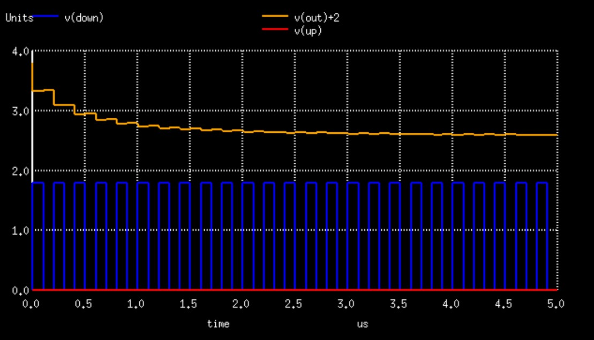

<b>Orange:</b> Charge Pump Output Voltage <br>
<b>Red:</b> Up Signal <br>
<b>Blue:</b> Down Signal

<h4> Charge Pump output rise due to charge leakage: </h4>

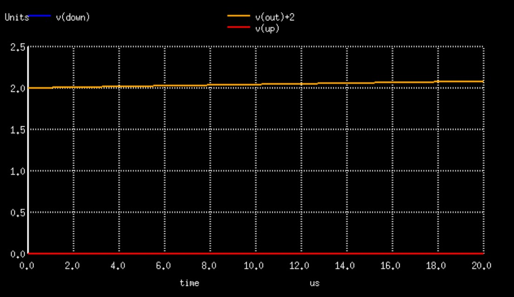

<b>Orange:</b> Charge Pump Output Voltage <br>
<b>Red:</b> Up Signal <br>
<b>Blue:</b> Down Signal <br>
<b>Leakage:</b> < 0.05V in 100us <br>

<h4> Frequency Divider: </h4>

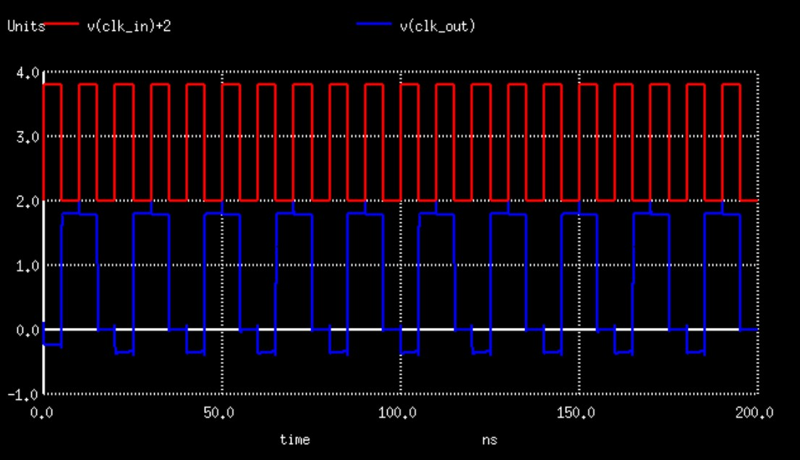

<b>Red:</b> Input Clock <br>
<b>Blue:</b> Output Clock <br>


<h3> EDA Tools Used: </h3>

* [kicad](https://kicad.org/) (schematic capture) <br>
* [ngspice](http://ngspice.sourceforge.net/download.html) (simulation) <br>
* [magic](http://opencircuitdesign.com/magic/) (layout design) 

<h3> Instructions: </h3>

<h4> For using magic for layout: </h4>

* Get magic v8.3.82 or above from [here](http://opencircuitdesign.com/magic) <br>
* Place the tech file [sky130.tech](https://github.com/lakshmi-sathi/avsdpll_1v8/blob/main/sky130.tech) in the folder where you'll be using magic <br>
* Open magic using the command:
    ```magic -T sky130```

<h4> For using ngpice for simulations: </h4>

* Get ngspice from [here](http://ngspice.sourceforge.net/) or for ubuntu users, just use this command: ```sudo apt-get install ngspice``` <br>
* Place the [sky130nm.lib](https://github.com/lakshmi-sathi/avsdpll_1v8/blob/main/sky130nm.lib) file in the folder you'll be running ngspice <br>
* Run the simulation: 
    ```ngspice PLL.cir``` 

<h3> Future Scope: </h3> 

* Incorporation of Trimmer Codes.
* Incorporation of PVT compensation circuit.

<h3> Acknowledgements: </h3>

* I thank Mr. Kunal Ghosh co-founder VSD, for providing me the opportunity to  work on this wonderful project

<h3> Contact: </h3>

* Lakshmi S (Author), MS ECE, Georgia Institute of Technology - lakshmi.sathi96@gmail.com
* Kunal Ghosh, Co-founder, VSD Corp. Pvt. Ltd. - kunalghosh@gmail.com

