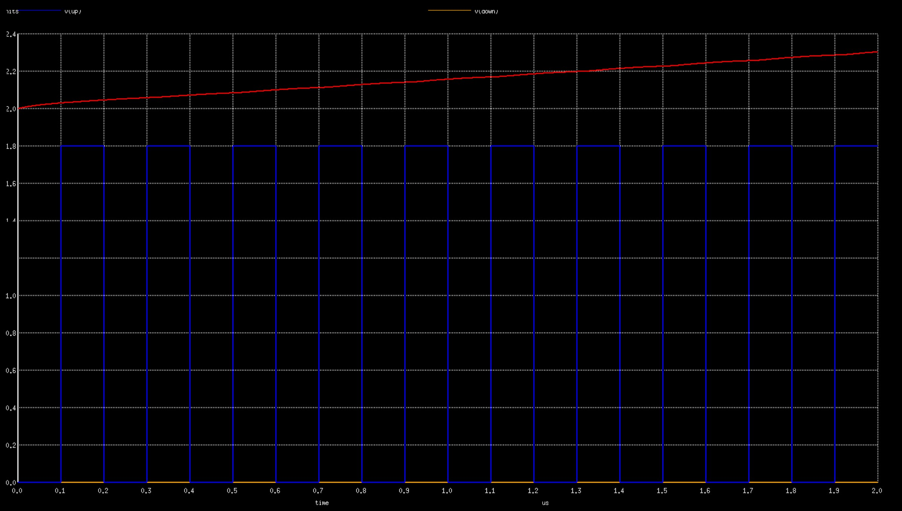
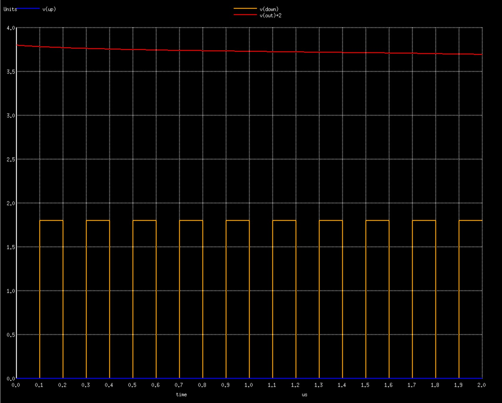

# 130nm PLL Clock Multiplier IP
8x PLL Clock Multiplier IP on the Google-Skywater 130nm node.

Tested through spice simulations on skywater 130nm tt corner at room termperature

Generates 8x Multiplied clock having 33% duty cycle

Output frequency obtained for input 5Mhz: 42MHz  (Required: 40Mhz) <br>
Output frequency obtained for input 12.5Mhz: 97Mhz   (Required: 100Mhz)

<h2> Contents: </h2>

1. [Google-SkyWater 130nm PDK](https://github.com/lakshmi-sathi/PLL_Clock_Multiplier_IP/blob/main/README.md-Google-SkyWater-130nm-PDK-)
2. [Pre-Layout Simulations](https://github.com/lakshmi-sathi/PLL_Clock_Multiplier_IP/blob/main/README.md#-Pre-Layout-Simulations-)
2. [EDA tools used](https://github.com/lakshmi-sathi/PLL_Clock_Multiplier_IP/blob/main/README.md#-EDA-tools-used-)
3. [Instructions for simulation](https://github.com/lakshmi-sathi/PLL_Clock_Multiplier_IP/blob/main/README.md#-Instructions-for-simulation-)
4. [Future Scope](https://github.com/lakshmi-sathi/PLL_Clock_Multiplier_IP/blob/main/README.md#-Future-Scope-)
5. [Acknowledgements](https://github.com/lakshmi-sathi/PLL_Clock_Multiplier_IP/blob/main/README.md#-Acknowledgements-)
6. [Contact](https://github.com/lakshmi-sathi/PLL_Clock_Multiplier_IP/blob/main/README.md#-Contact-)

<h3> Google-SkyWater 130nm PDK: </h3>

>This PLL circuit is built on the [Google-Skywater 130nm](https://github.com/google/skywater-pdk) node. It is a mature 180nm-130nm hybrid technology originally developed internally by Cypress Semiconductor.<br>
>The SkyWater Open Source PDK is a collaboration between Google and SkyWater Technology Foundry to provide a fully open source Process Design Kit and related resources, which >can be used to create manufacturable designs at SkyWater’s facility. 

<h3> Pre-Layout Simulations: </h3>

<h4> PLL Output (tt, 27degree Celcius): </h4>

<h5> In:5Mhz, Out: 42Mhz </h5>


Red: Up Signal
Blue: Down Signal
Orange: Input Reference Clock
Green: Charge Pump Output
Pink: PLL Clock Output

<h5> In:12.5Mhz, Out: 97Mhz </h5>


Red: Up Signal
Blue: Down Signal
Orange: Input Reference Clock
Green: Charge Pump Output
Pink: PLL Clock Output

<h4> Output Wave (33% Duty Cycle): </h4>


<h4> Phase Detector 'Up' Signal (unbuffered): </h4>


<h4> Phase Detector 'Down' Signal (unbuffered): </h4>


<h4> Charge Pump response to 'Up' signal: </h4>



<h4> Charge Pump response to 'Down' signal: </h4>



<h4> Frequency Divider (unbuffered): </h4>


Custom selection of Phase Detector and Frequency Divider circuits were made to improve stability and reduce area/power consumption:
* [Phase Detector](https://github.com/lakshmi-sathi/PLL_Clock_Multiplier_IP/tree/main/PhaseDetector)

* [Frequency Divider](https://github.com/lakshmi-sathi/PLL_Clock_Multiplier_IP/tree/main/FrequencyDivider) 

* [Charge Pump](https://github.com/lakshmi-sathi/PLL_Clock_Multiplier_IP/tree/main/ChargePump)

<h3> EDA Tools Used: </h4>

* [ngspice](http://ngspice.sourceforge.net/download.html) (simulation) <br>
* [kicad](https://kicad.org/) (schematic capture)

<h3> Instructions for simulation: </h3>

* The required sky130nm primitives are present inside the 'Sky130_Primitives' folder and already included inside PLL.cir
* Install ngspice if not already installed: 
    On Ubuntu systems - ```sudo apt-get install ngspice```
* Clone the repo:
    ```git clone https://github.com/lakshmi-sathi/PLL_Clock_Multiplier_IP.git```
* Move to the cloned repo directory.
* Run the simulation: 
    ```ngspice PLL.cir``` 

<h3> Future Scope: </h3> 

* Incorporation of Trimmer Codes.
* Incorporation of PVT compensation circuit.

<h3> Acknowledgements: </h3>

* I thank Mr. Kunal Ghosh co-founder VSD, for providing me the opportunity to  work on this wonderful project

<h3> Contact: </h3>

* Lakshmi S (Author), MS ECE, Georgia Institute of Technology, Atlanta - lakshmi.sathi96@gmail.com
* Kunal Ghosh, Co-founder, VSD Corp. Pvt. Ltd. - kunalghosh@gmail.com

