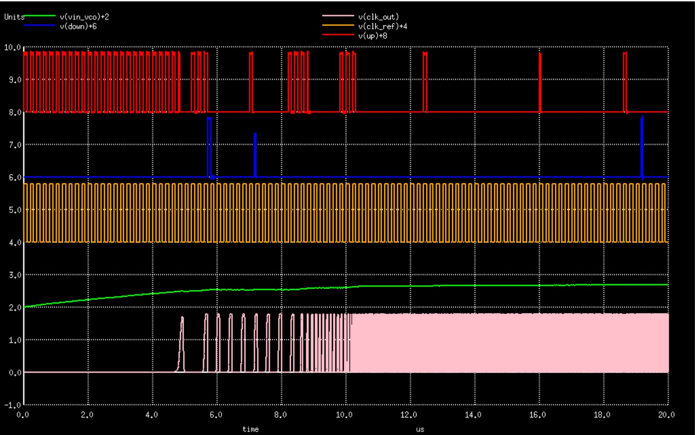
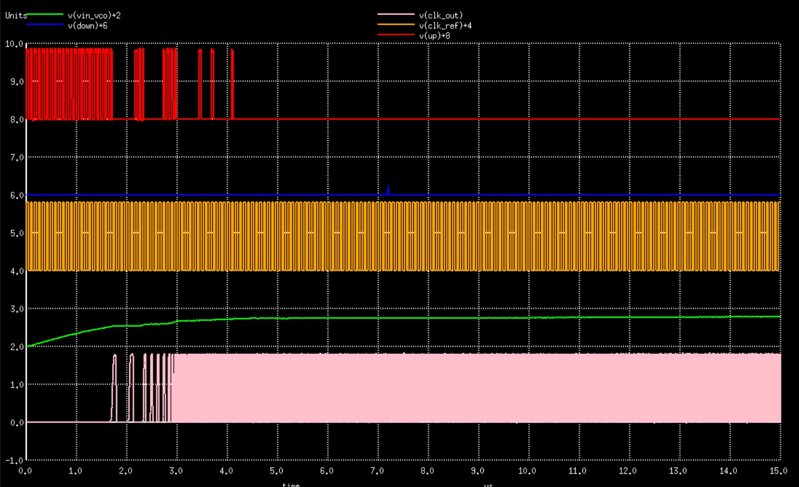

# 130nm PLL Clock Multiplier IP
8x PLL Clock Multiplier IP on the Google-Skywater 130nm node.

Tested through spice simulations on skywater 130nm tt corner at room termperature

Generates 8x Multiplied clock having 33% duty cycle

Output frequency obtained for input 5Mhz: 42MHz  (Required: 40Mhz) <br>
Output frequency obtained for input 12.5Mhz: 97Mhz   (Required: 100Mhz)


<h4> PLL Output (tt, 27degree Celcius): </h4>

<h5> In:5Mhz, Out: 42Mhz </h5>



<h5> In:12.5Mhz, Out: 97Mhz </h5>



<h4> Output Wave (33% Duty Cycle): </h4>


Custom selection of Phase Detector and Frequency Divider circuits were made to improve stability and reduce area/power consumption:
* [Phase Detector](https://github.com/lakshmi-sathi/PLL_Clock_Multiplier_IP/tree/main/PhaseDetector)

* [Frequency Divider](https://github.com/lakshmi-sathi/PLL_Clock_Multiplier_IP/tree/main/FrequencyDivider) 

* [Charge Pump](https://github.com/lakshmi-sathi/PLL_Clock_Multiplier_IP/tree/main/ChargePump)

<h4> EDA Tools Used: </h4>

* [ngspice](http://ngspice.sourceforge.net/download.html) (simulation) <br>
* [kicad](https://kicad.org/) (schematic capture)

<h4> Instructions for simulation: </h4>

* The required sky130nm primitives are present inside the 'Sky130_Primitives' folder and already included inside PLL.cir
* Install ngspice if not already installed: 
    On Ubuntu systems - ```sudo apt-get install ngspice```
* Clone the repo:
    ```git clone https://github.com/lakshmi-sathi/PLL_Clock_Multiplier_IP.git```
* Move to the cloned repo directory.
* Run the simulation: 
    ```ngspice PLL.cir``` 

<h4> Future Scope: </h4> 

* Incorporation of Trimmer Codes.
* Incorporation of PVT compensation circuit.

<h4> Author: </h4>

Lakshmi S - lakshmi.sathi96@gmail.com

<h4> Acknowledgments: </h4>

* I thank Mr. Kunal Ghosh co-founder VSD, for providing me the opportunity to  work on this wonderful project
* I also thank Paras Gidd, who's work has been greatly helpful in helping me shape mine.

<h4> Contacts: </h4>

* Lakshmi S (Author), MS ECE, Georgia Institute of Technology, Atlanta - lakshmi.sathi96@gmail.com
* Kunal Ghosh, Co-founder, VSD Corp. Pvt. Ltd. - kunalghosh@gmail.com
* Paras Gidd, M.Tech.( Microelectronics ), Manipal Institute of Technology,(MAHE) - parasgidd@gmail.com

