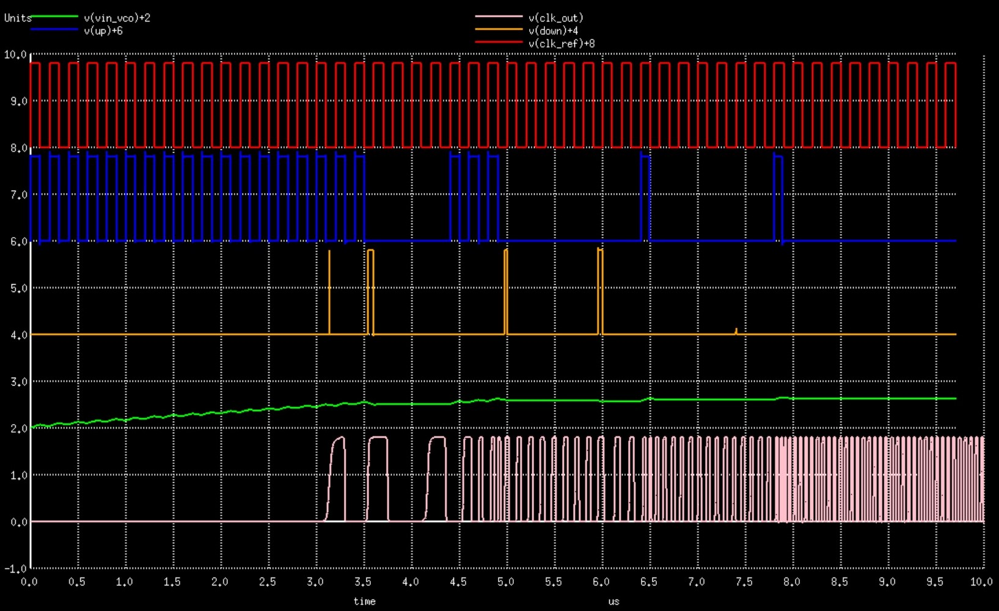

# 130nm PLL Clock Multiplier IP
8x PLL Clock Multiplier IP on the Google-Skywater 130nm node.

Tested through spice simulations on skywater 130nm tt corner at room termperature

Generates 8x Multiplied clock having 33% duty cycle

Output frequency obtained for input 5Mhz: 37MHz  (Required: 40Mhz)
Output frequency obtained for input 12.5Mhz: 95Mhz   (Required: 100Mhz)

<h4> PLL Output (tt, 27degree Celcius): </h4>



<h4> Output Wave (33% Duty Cycle): </h4>


Custom selection of Phase Detector and Frequency Divider circuits were made to improve stability and area/power consumption:
* [Phase Detector](https://github.com/lakshmi-sathi/PLL_Clock_Multiplier_IP/tree/main/PhaseDetector)

* [Frequency Divider](https://github.com/lakshmi-sathi/PLL_Clock_Multiplier_IP/tree/main/FrequencyDivider) 

<h4> Instructions for simulation: </h4>

* The required sky130nm primitives are present inside the 'Sky130_Primitives' folder and already included inside PLL.cir
* Install ngspice if not already installed: 
    On Ubuntu systems - ```sudo apt-get install ngspice```
* Clone the repo:
    ```git clone https://github.com/lakshmi-sathi/PLL_Clock_Multiplier_IP.git```
* Move to the cloned repo directory.
* Run the simulation: 
    ```ngspice PLL.cir```

<h4> References: </h4> 

<b> [[1](https://github.com/lakshmi-sathi/PLL_Clock_Multiplier_IP/tree/main/FrequencyDivider)] </b> Q. Du, J. Zhuang and T. Kwasniewski, "A Low Phase Noise Dll Clock Generator with a Programmable Dynamic Frequency Divider," 2006 Canadian Conference on Electrical and Computer Engineering, Ottawa, Ont., 2006, pp. 701-704, doi: 10.1109/CCECE.2006.277703. <br>
<b> [[2](https://github.com/lakshmi-sathi/PLL_Clock_Multiplier_IP/tree/main/PhaseDetector)] </b> KK Abdul Majeed, Binsu J. Kailath, "A novel phase frequency detector for a high frequency PLL design," Procedia Eng. 64 (2013) 377–384.

<h4> Future Scope: </h4> 

* Incorporation of Trimmer Codes.
* Incorporation of PVT compensation circuit

<h4> Acknowledgments: </h4>

* I thank Mr. Kunal Ghosh co-founder VSD, for providing me the opportunity to  work on this wonderful project
* I also thank Paras Gidd, who's work has been greatly helpful in helping me shape mine.
